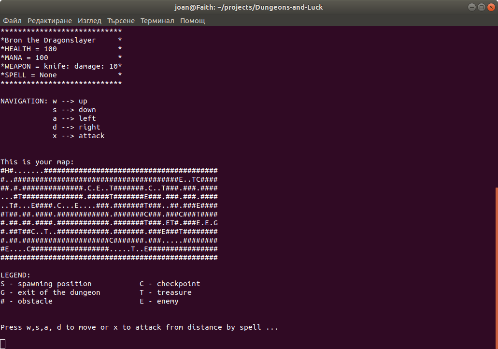

# *Dungeons and Luck*

*Това е игра с конзолен интерфейс (CLI), вдъхновена от популярната DnD. Работи под Linux.*

## Как да си сваля и използвам проекта?

1) [install git](https://www.linode.com/docs/development/version-control/how-to-install-git-on-linux-mac-and-windows/)
2) install [python](https://www.python.org/downloads/release/python-369/) 3.6
3) `git clone https://github.com/dzhelek/Dungeons-and-Luck.git`
4) `cd Dungeons-and-Luck`
5) `python3 main.py`

## Използвани технологии

* [Python](https://www.python.org/) - *известен език за програмиране от високо ниво*

## Информация за авторите на проекта

* **Антони Стоев** - *програмист* - [astoeff](https://github.com/astoeff)
* **Йоан Джелекарски** - *програмист* - [dzhelek](https://github.com/dzhelek)

